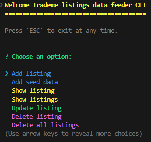
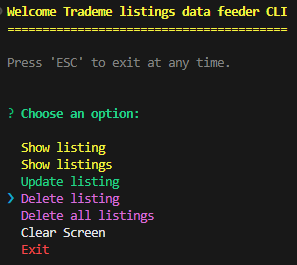

# Intro

This app was built as the **Task 5** of **Mission 5 - Phase 1** at **Mission Ready HQ**. 

### Objective of the task
Develop a command-line interface (CLI) tool to seed data into your local MongoDB database or delete data from it.  Ensure that this tool is source-controlled and includes the seed data.  Team members should be able to seed data by cloning the repository.  Add sample data for a few auction items with the following 4 fields: title, description, start_price, reserve_price.

### Approach
After playing a bit with [readline](https://www.npmjs.com/package/readline0), [commander](https://www.npmjs.com/package/commander) and inquirer, I decided to go with inquirer for handling user inputs.

## Build with

* [NodeJS](https://nodejs.org/en)
* [Mongoose](https://www.npmjs.com/package/mongoose)
* [Inquirer](https://www.npmjs.com/package/inquirer)
* [Chalk](https://www.npmjs.com/package/chalk)
* [dotenv](https://www.npmjs.com/package/dotenv)


## Folder structure


**CLI.js** - This is the file that contains main function of this CLI.

**MongoDB.js** - This file contains the connection to MongoDB database and import in CLI.js

**Inquirer_prompts.js** - This file contains the prompts used with inquirer package.

**ListingsSchema.js** - This file contains schema structure for Listings collection.

**ListingsCollection.js** - This file creates Listings model based on the schema at ListingsSchema.js.

**Listing_transactions.js** - This file contains all the CRUD operations for Listings collection. It imports ListingsCollection.js file and exports all the functions to CLI.js.


## Instructions

Use the following command to clone the repository. 
``` 
git clone https://github.com/romeshl/CLI-for-MongoDB-Mission-5-Phase-1.git
```

You will need to create a **.env** file in the root of the folder to hold the MongoDB connection string. (Example below)

```
MONGODB_CONNECTION_STRING=mongodb://localhost:27017/trademe
```

and then the following command to run install dependencies. 
```
npm install
```

and then the following command, so that you can run the CLI on the terminal. 
```
npm i -g
```

To start the CLI use the following command.
```
mongo-cli
```

### Main menu

<br>
<br>


I believe the menus are self-explanatory. 

If you don't have any data in your collection you may run **Add seed data** first to populate your collection with some sample data from **Seed_Data/trademe.listings.json** file.

**Show listing, Update listing, Delete listing** all need an ID number. You can use the **Show listings** to show the listings and copy the ID from there.

You can use **ESC** key anytime to return to the terminal.

